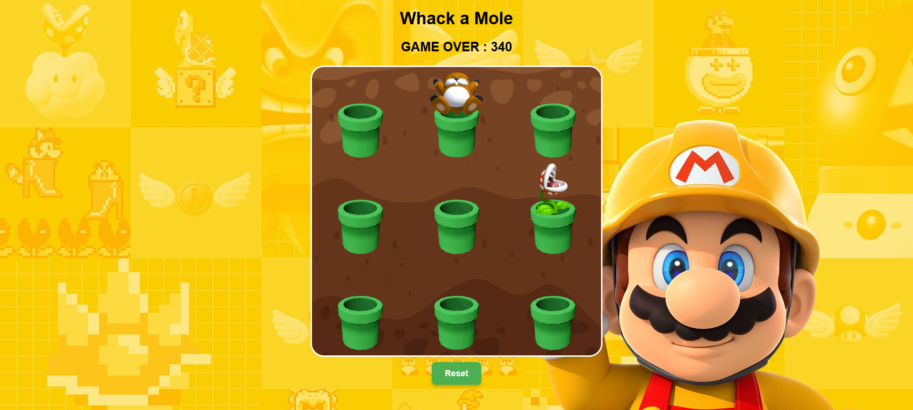

# 🎯 Whack-a-Mole Game

A fun and interactive browser-based game where you whack the appearing moles before time runs out! This project is built using HTML, CSS, and JavaScript.

---

## 📸 Screenshot



---

## 🎮 Features

- 🕹️ Interactive gameplay with popping moles
- ⏱️ Timer-based challenge
- 🔊 Sound effects on mole hit
- 🎚️ Multiple difficulty levels (Easy, Medium, Hard)
- 📱 Responsive design (playable on mobile & desktop)

---

## 🚀 How to Play

1. Click the **Start** button.
2. Whack the moles by clicking on them when they pop up.
3. Score as many hits as possible before time runs out!
4. Select difficulty to increase mole speed.

---

## 🛠️ Tech Stack

- **HTML5** – Structure of the game
- **CSS3** – Styling, animations, and layout
- **JavaScript** – Game logic, timer, interactivity, and sound effects

---

## 🔧 Setup Instructions

1. Clone the repository:

```bash
git clone https://github.com/JhanvibaZala/whack-a-mole-game.git
````

2. Open `index.html` in your browser.
3. Start playing and enjoy!

---

## 🌟 Future Enhancements

* Add a leaderboard system
* Save scores locally or on a server
* Add dark mode

---

## 📦 Assets Credits

* Sound effects: [freesound.org](https://freesound.org/) *(or replace with actual link if known)*
* Icons and visuals: [flaticon.com](https://www.flaticon.com/)

---

## 🙋‍♀️ Author

Made with ❤️ by [Jhanvi Zala](https://github.com/JhanvibaZala)

---

## 📄 License

This project is open-source and available under the [MIT License](LICENSE).

````

---

### ✅ Final Checklist:

- 📂 Add your screenshot at: `./assets/screenshot.png`
- ✅ Save the above content as `README.md` in your project root
- 🧠 Then push the changes:

```bash
git add README.md assets/screenshot.png
git commit -m "Added README with screenshot"
git push origin main
````
